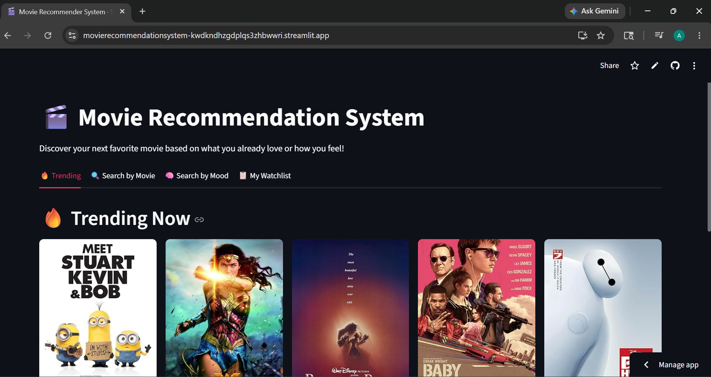
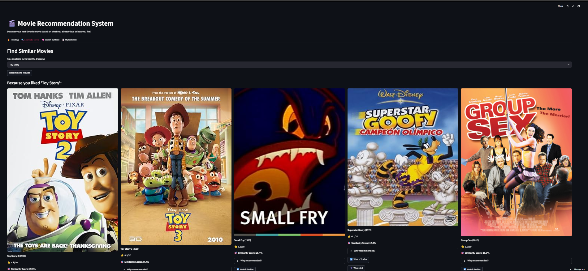
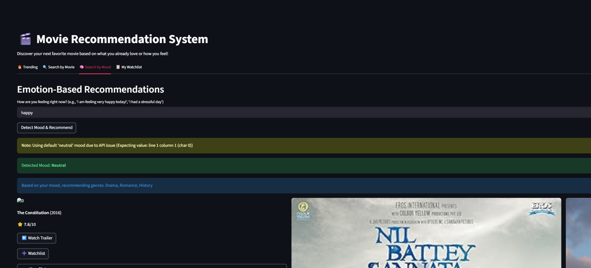
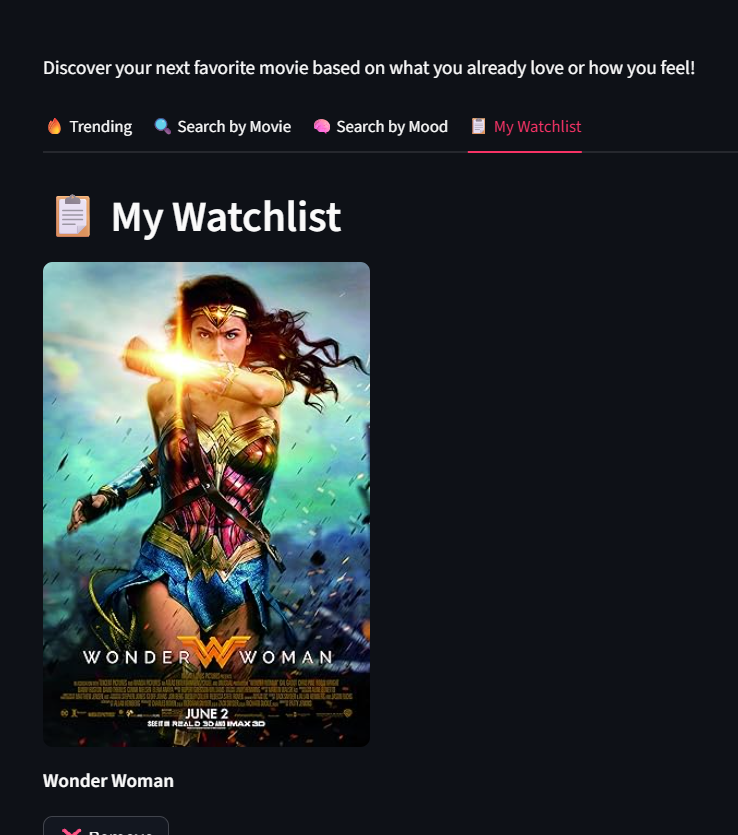

# 🎬 AI Movie Recommendation System

An AI-powered Movie Recommendation System built using Machine Learning, NLP, Streamlit, and real-time APIs.

## 🚀 Live Demo

https://movierecommendationsystem-kwdkndhzgdplqs3zhbwwri.streamlit.app/

---

## 📌 Features

- 🎥 Movie Recommendation Engine
- 🧠 TF-IDF Vectorization
- 📊 Cosine Similarity Matching
- 😊 Mood-Based Recommendations
- 🖼️ Movie Posters & Ratings
- ▶️ Trailer Search Links
- 📋 Watchlist Feature
- 🌙 Dark Mode UI
- ☁️ Live Deployment using Streamlit Cloud

---
## 📸 Screenshots

### 🏠 Home Page



---

### 🎬 Movie Recommendations



---

### 😊 Mood-Based Recommendations



---

### 📋 Watchlist Feature




## 🛠️ Technologies Used

- Python
- Streamlit
- Pandas
- Scikit-learn
- NLP
- OMDb API
- Hugging Face API
- Git & GitHub

---

## 📂 Project Structure

MovieRecommendationSystem/

│── app.py  
│── model.py  
│── requirements.txt  
│── README.md  
│── .gitignore  
│── df.pkl  
│── indices.pkl  
│── tfidf.pkl  
│── tfidf_matrix.pkl  

---

## 🧠 Machine Learning Concepts

This project uses:

- TF-IDF Vectorization
- Content-Based Filtering
- Cosine Similarity

Formula used:

Cosine Similarity(A,B) = (A·B) / (||A|| ||B||)

---

## ⚡ Installation

```bash
git clone https://github.com/AbhayDw/Movie_Recommendation_System.git
cd Movie_Recommendation_System
pip install -r requirements.txt
streamlit run app.py
